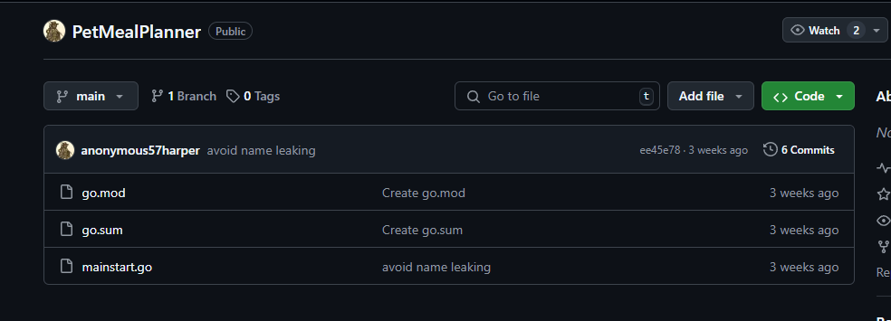
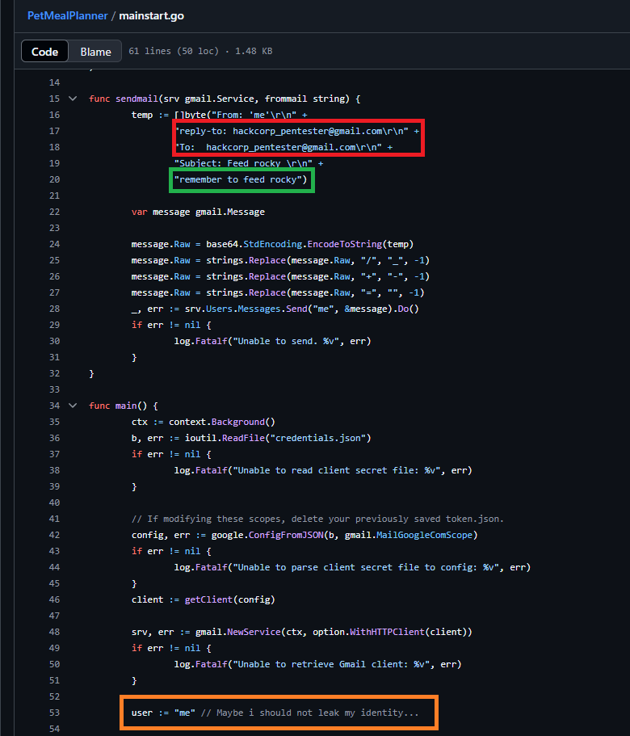
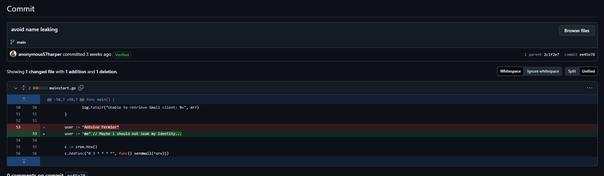
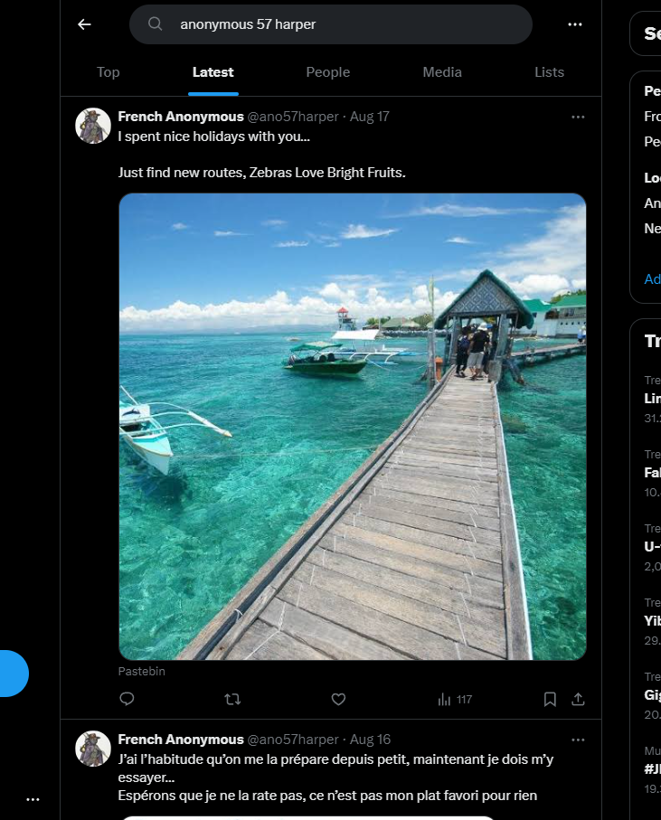
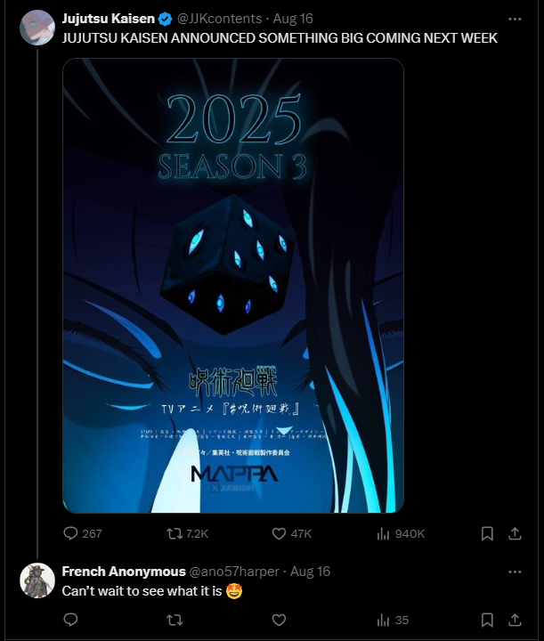
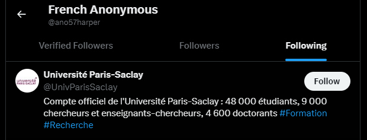
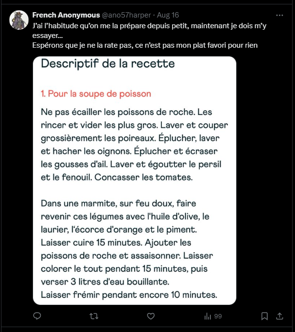
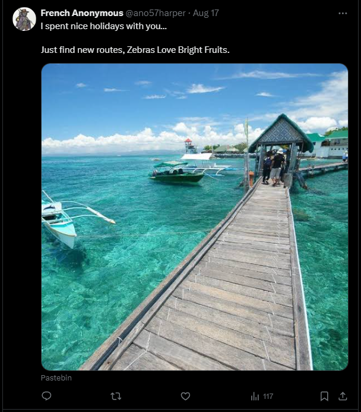
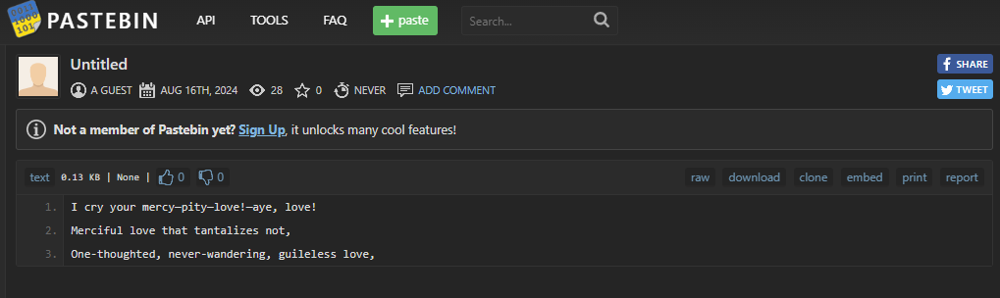
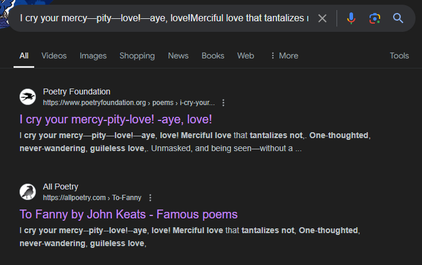

# MEDITERRANIAN INVESTIGATION

## Introduction

Mediterranean Investigation was a 24-hour OSINT-based challenge with a difficulty rated as medium and a total of 300 points. The task was to gather personal information about a target using open-source techniques.

The task was to investigate the name "anonymous57harper", and find the following informations:

- The user's real first name.
- The user's family name.
- The user's dog's name.
- The user's favourite anime.
- The user's university.
- The user's email.
- The user's job position.
- The user's favorite food.
- The user's favourite woman's name.

Once these information was gathered, we would need to put them together and fulfill the flag format of:

- `FSIIECTF{firstname_familyname_dogname_favouriteanime_university-name_favoritefood_jobposition_email_favouritewomansname}`

In the case of spaces in the word, we had to replace it with "-", and the spaces between words must be replaced by an underscore.

## Step 1: Username Search

With the given username Fanonymous57harper, the first instinct was to check whether this username was associated with any online profiles or social media accounts with the [What's My Name tool](https://whatsmyname.app/). After the search, the results were a github account with the name "anonymous57harper". Within said account, there was a GitHub repository called PetMealPlanner. The repo had a few files, including mainstart.go.

Within said file, the code showed several important information that such as the user's dog name, his email and his job position.

Email: hackcorp_pentester@gmail.com, Dog name: Rocky, Job position: Pentester

In the same image, the orange box highlighted the fact that the user attempted to not leak their name. This is also seen in the git commit history and if we backtrack it, we can see the latest changes which conveniently titled "avoid name leaking", contained the real name of the user.

First name : Antoine, Family name : Fermier

## Step 2: Social Media Search

After searching the username on several platforms, we hit a dead end with no results on most social media, including Instagram, even the real name found in the repo seemed to be a rabbit hole.

Right before we threw in the towel, we tried searching for "anonymous 57 harper" on Twitter and in the "Latest" tab, we found a Twitter account with the handle @ano57harper that matched the GitHub profile picture, confirming it as the same user.

From the twitter, we can uncover a few different information. Firstly, we can determine that the user's favourite anime is Jujutsu Kaisen through the user replying to the official account of the anime.

We can also uncover the fact that the user's university is the University Paris-Saclay. This is evident by the fact that the user is following the official account of the University.

## Step 3: Favourite Dish

Now that the only remaining ones are his favourite food and favourite woman. By going through his Twitter timeline, we can find two posts that relate to these two things. First, let's try to find his favourite food. From the tweet shown below, we can see that he has posted a recipe in French.

We can tell that this is the favourite dish because once it is translated to english, it is "I'm used to having it prepared for me since I was little, now I have to try it...
Let’s hope I don’t miss it, it’s not my favorite dish for nothing". By inputting the first few sentences into Google, we can find out the exact website in which the recipe came from.

This dish is called "La bouillabaisse Marseillaise traditionnelle", which is "Traditional Marseille Bouillabaisse". With that, we can then determine that the user's favourite dish is Bouillabaisse.

## Step 4: Favourite Woman

Lastly, we need to find the final information whch is his favourite woman. The final Tweet is a picture of a location with the Tweet "I spent nice holidays with you… Just find new routes, Zebras Love Bright Fruits."

While the first instinct is to immediately reverse search the image and determine the location, we realized that there is a mediatag at the bottom of the post. The mediatag is for the official account of the Pastebin. This means that whatever we are searching for is found in a pastebin, however, the pastebin link isn't given to us directly.

Upon taking a closer look at the Tweet again, the sentence "Just find new routes, Zebras Love Bright Fruits." makes close to no sense and the capitalization is all wrong. This means that if we take the first letter of each words in the sentence, we can get a the end of the url of a pastebin, which is `https://pastebin.com/JfnrZLBF`.

By taking the texts in the pastebin and searching it up on Google, we can find that it is a poem by John Keats, titled "To Fanny".

And that's it, that's all the information we needed!

## Final Step: Submitting the Flag

Now, we can finalize all the information.

- The user's real first name. : Antoine
- The user's family name. : Fermier
- The user's dog's name. : Rocky
- The user's favourite anime. : Jujutsu Kaisen
- The user's university. : University Paris-Saclay
- The user's email. : hackcorp_pentester@gmail.com
- The user's job position. : Pentester
- The user's favorite food. : Bouillabaisse
- The user's favourite woman's name. : Fanny

With all this information, we can put it all into the flag format, and it would look something like this:

- `FSIIECTF{antoine_fermier_rocky_jujutsu_kaisen_paris-saclay_pentester_bouillabaisse_hackcorp_pentester@gmail.com_fanny}`

# Conclusion

This challenge was a ton of fun and we thoroughly enjoyed the whole process of piecing together clues from different sources. It was rewarding to see all the bits of information come together. That said, the fact that the Twitter handle didn’t match the original username was super frustrating and added some unnecessary difficulty but that is due to the fact that twitter has a 15 character limit for their handles. In the end, it all worked out, and it was a fun experience overall!

Honestly, poor Antonie Fermier, a ton of other groups probably spammed his inbox hoping for something. 😭

