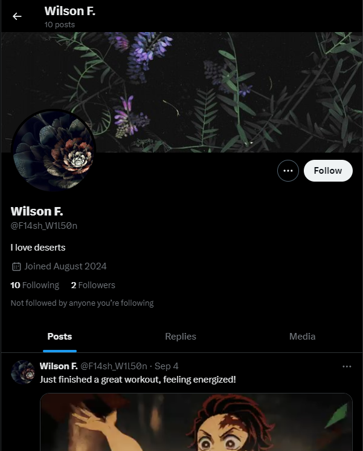
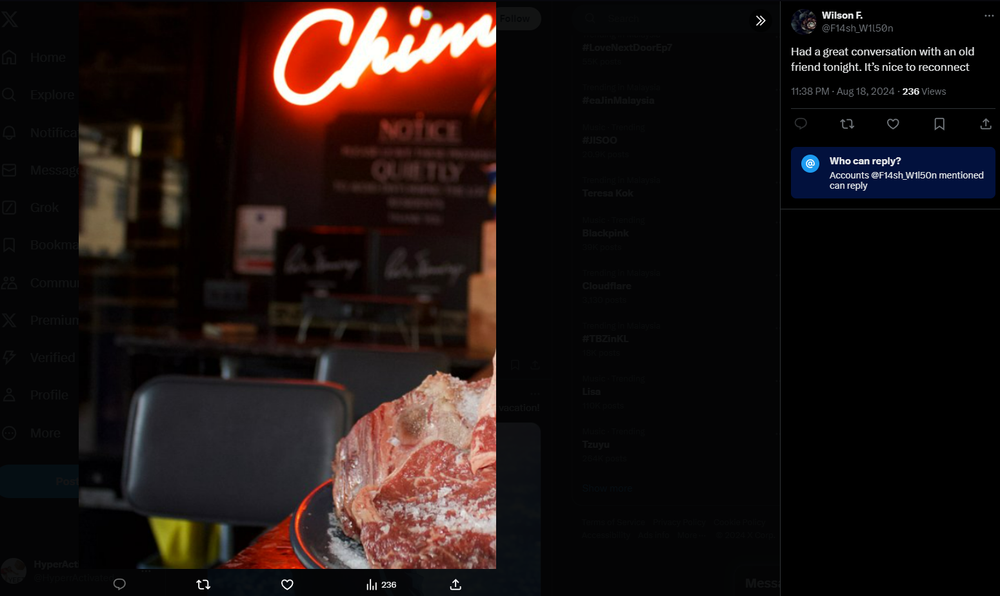
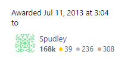
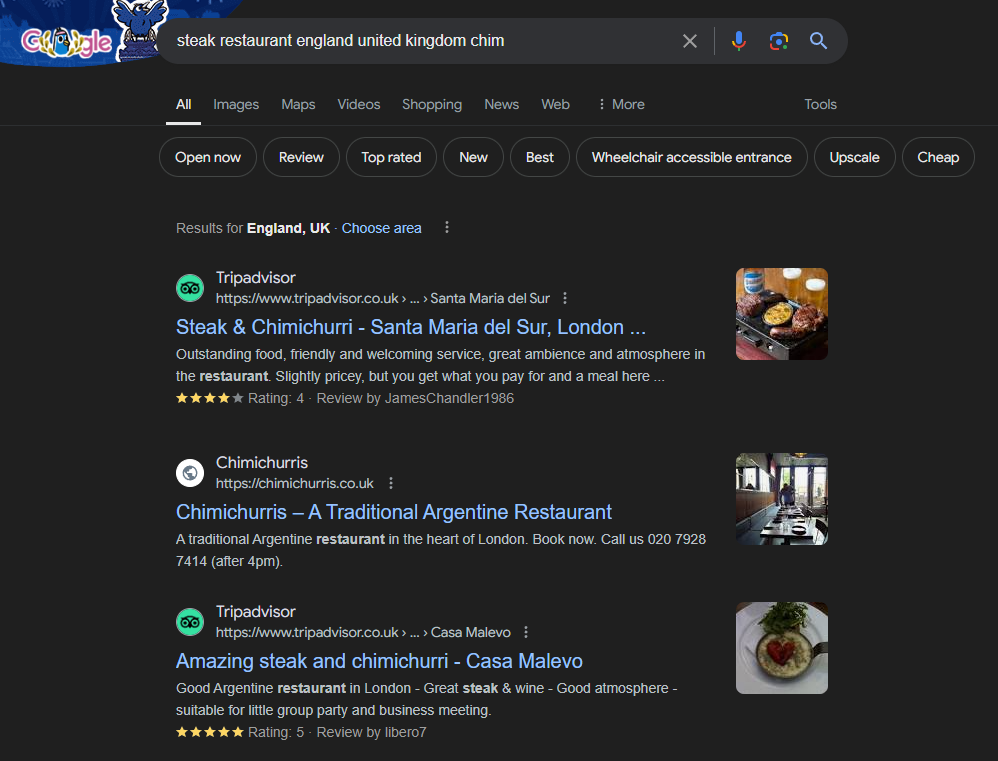
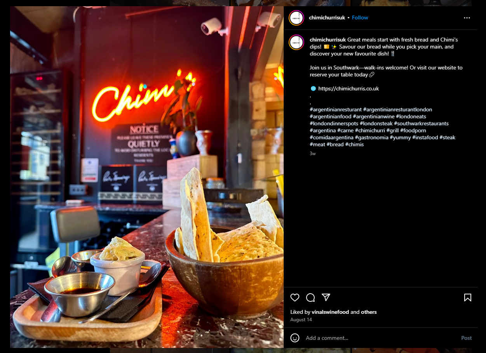
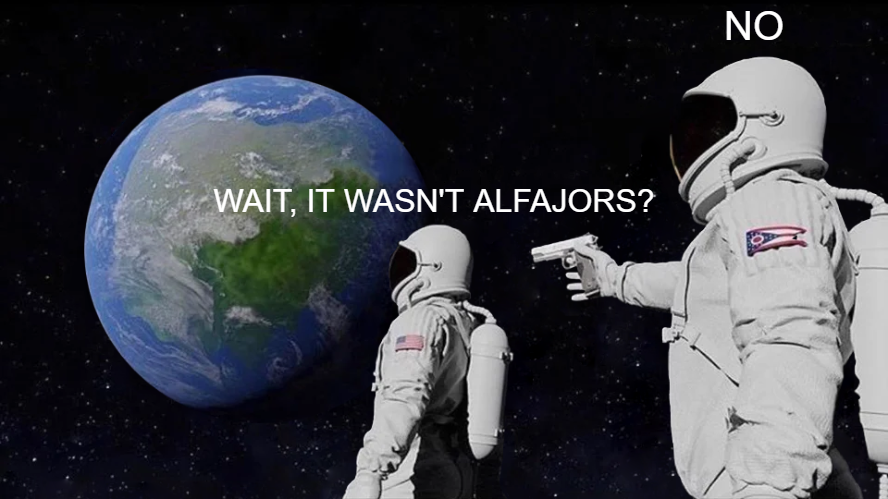

# STALK THE DATE

## Introduction

Stalk The Date was a 24-hour OSINT-based challenge with a difficulty rated as hard and a total of 500 points. The task was to gather personal information about a target using open-source techniques.

The task was to:

- Investigate the name "F14sh_W1l50n". Who loved desserts. 👍
- Using his Gold HTML badge from July 2013, find his country.
- Determine his favorite restaurant.
- Identify his favorite dessert.
- Finally, md5 hash his favorite restaurant and dessert (in plural) in the format: `Favouriterestaurant_Favouritedessertinplural`
  and submit it as `FSIIECTF{hash}`.

The challenge was rated Hard, with a max score of 500 points. The first team to finish got the full score, while others received just 1 point, highlighting the need for speed and accuracy.

## Step 1: Username Search

With the given username F14sh_W1l50n, my first approach was to check whether this handle was associated with any online profiles or social media accounts. For this, we used the [What's My Name tool](https://whatsmyname.app/). After starting the search, we found results that shows the username was associated with a Twitter account.

Once we confirmed that F14sh_W1l50n was associated with a Twitter account, we began exploring the user's activity on the platform and after scrolling through their timeline, we found a tweet containing a picture that appeared to be taken at a restaurant. However, the image had been deliberately cropped, making it challenging to gather clear details.

From what was visible in the picture, we could make out a neon sign with cut-out letters that read “Chim-”, there was also a plate on the table with raw steak.

## Step 2: Gold HTML Badge

Now, we shift focus to further clue which was the user's country. The challenge told us that there was a user that had earned the gold HTML badge gained in July 2013, which led me to search on Stack Overflow as it was the only website that gave badges for computing skills.

During the search, we identified a user who was the only one who had earned the HTML badge in July 2013. We can see that he is from England, United Kingdom, thus providing us the country information required by the challenge. Since the challenge specified that only the country information was necessary at this stage, we did not delve further into the user's profile.

## Step 3: Google Searching

With the clues that are : the word "Chim-" a steak dish, and the location England, it was clear that the next step was to search for restaurants matching these descriptions. So, we decided to put everything together and try a Google search using the terms "steak restaurant england united kingdom chim".

The search results gave me several restaurant options, and we decided to dig through the top 2 restaurants. we landed on one restaurant's social media in particular, Chimichurris, featuring the same neon sign and same table we had seen in the Twitter photo.

That's the same restaurant and table from the twitter photo! Now, we just need to go ahead and find the user's favourite dessert.

## Step 4: Finding and Hashing

Now that we had confirmed Chimichurris as Wilson's favorite restaurant, the next task was to determine his favorite dessert from the menu. I navigated to the restaurant's website to take a look at their dessert offerings.

On the dessert menu, we found four potential options:

- Panqueque with Dulce de Leche
- Almond Pudding
- Empanada de Manzana
- Alfajor Helado

Despite there being 5 options, Ice cream was ruled out since it wasn’t specific enough, leaving me with 4 solid choices. Now with the four remaining dessert options,we needed to determine which one was the favorite. By hashing the restaurant name, Chimichurris, along with each dessert name, we generated unique MD5 hashes for each option.

- Panqueques : Chimichurris_Panqueques => FSIIEC{fa70e925f20f156ec4018f4fecf9bb24}
- Puddings : Chimichurris_Puddings => FSIIEC{8d949fc11c395fead984d46235adea30}
- Empanadas : Chimichurris_Empanadas => FSIIEC{99dfdd963422ee6b4acd98b5d62a4301}
- Alfajores : Chimichurris_Alfajores => FSIIEC{d797712b3bbefdd084aab2e43f235d36}

After tring out all 4 hashes, we found that the challenge accepted the answer FSIIEC{d797712b3bbefdd084aab2e43f235d36}, which corresponded to the Alfajores dessert. This confirmed that F14sh_W1l50n’s favorite dessert was Alfajores!

## Conclusion

Just like that, we found Wilson's favourite restaurant and dessert! Now we can stalk his date :)

The challenge was both frustrating and fun. The format caused confusion, as the first letters of the restaurant and dessert had to be capitalized, and the dessert had to be plural and one word. This made finding the flag tricky, but once we figured it out, it was incredibly rewarding!

