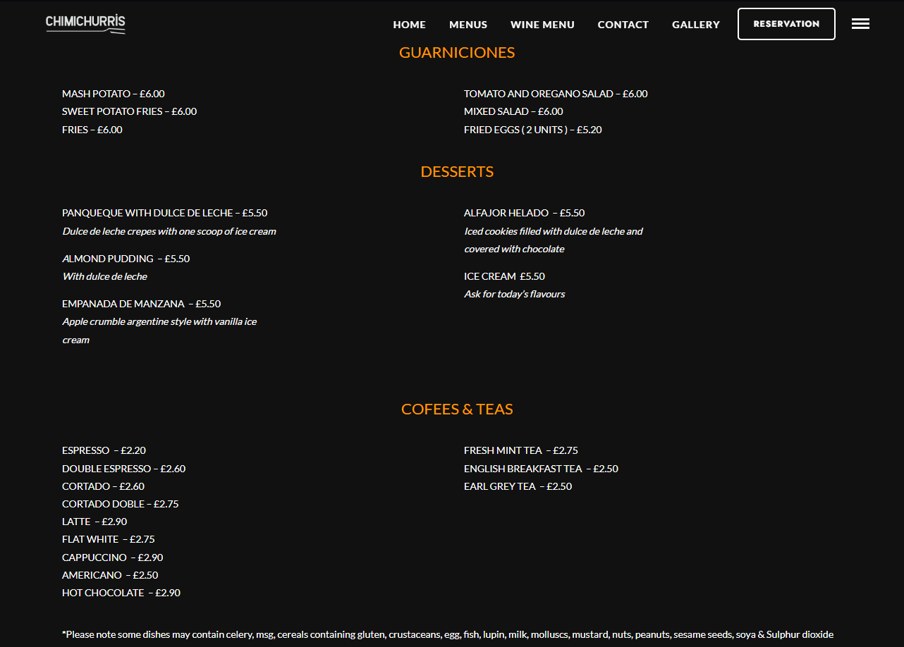

# FSIIEC-CTF 2024

[FSIIEC](FSIIEC.png)

## Introduction

Stalk The Date, was an OSINT-based task with a duration of 24 hours. The goal was to gather personal information about a specific target through open-source intelligence techniques. The difficulty level of the challenge was rated as hard and had given a total points of 300.

The task was to:

- Find information regarding the name "F14sh_W1l50n". He also loved desserts. 👍
- With the information that he has gained the Gold HTML badge at July 2013, find what country he is in.
- Find the user's favorite restaurant.
- Find the user's favorite dessert.
- Once completed, md5 hash his favourite restaurant's name and his favourite dessert's name (in plural) together in this format: `Favouriterestaurant_Favouritedessertinplural`
  and submit with the flag format of `FSIIECTF{hash}`.

The challenge was categorized as Hard, and the scoring system reflected this difficulty. Initially, the maximum score for completing the task was 300 points. However, due to the competitive nature of the CTF, the first team to complete the challenge received the full 300 points, while all other teams would only score 1 point upon completion, emphasizing the importance of speed and accuracy.

## Step 1: Username Search

With the given username F14sh_W1l50n, my first approach was to check whether this handle was associated with any online profiles or social media accounts. For this, we used the [What's My Name tool](https://whatsmyname.app/), which allows users to search for a username across multiple platforms.

After initiating a search with F14sh_W1l50n, the tool quickly returned results showing that this username was associated with a Twitter account.

Once we confirmed that F14sh_W1l50n was associated with a Twitter account, we began exploring the user's activity on the platform. After scrolling through their timeline, we found a tweet containing a picture that appeared to be taken at a restaurant. However, the image had been deliberately cropped, making it challenging to gather clear details.

From what was visible in the picture, we could make out a neon sign with partially cut-out letters that read “Chim”. Additionally, there was a plate on the table featuring what seemed to be a raw steak. Although the image was cropped and somewhat unclear, the presence of the neon sign and the food provided important clues that we could use to narrow down my search for the specific restaurant.

## Step 2: Gold HTML Badge

After identifying F14sh_W1l50n's Twitter account and analyzing the image posted, we shifted focus to further clues. The next lead came from searching a gold HTML badge gained in July 2013, which led me to search on Stack Overflow for users who had claimed this specific badge during that time.

During the search, we identified a user who was the only one who had earned the HTML badge in July 2013. Upon reviewing their profile, it is evident they are located in England, United Kingdom, providing the country information required by the challenge. Since the challenge specified that only the country information was necessary at this stage, we did not delve further into the user's profile.

## Step 3: Google Searching

With these clues in hand—the word "Chim," a steak dish, and the UK location—it seemed clear that the next step was to search for restaurants matching these descriptions. So, we decided to put everything together and try a Google search using the terms "steak restaurant england united kingdom chim."

The search results gave me several restaurant options, and we decided to dig through the top 2 restaurants. we landed on one restaurant's social media in particular, Chimichurris, featuring the same neon sign and same table we had seen in the Twitter photo.

That's the restaurant found! Now, we just need to go ahead and find the user's favourite dessert.

## Step 4: Finding and Hashing

Now that we had confirmed Chimichurris as Wilson's favorite restaurant, the next task was to determine his favorite dessert from the menu. I navigated to the restaurant's website to take a look at their dessert offerings.

On the dessert menu, we found four potential options:

- Panqueque with Dulce de Leche
- Almond Pudding
- Empanada de Manzana
- Alfajor Helado

Despite there being 5 options, Ice cream was ruled out since it wasn’t specific enough, leaving me with four solid choices. With the four remaining dessert options: Panqueques, Puddings, Empanadas, and Alfajores. Now, we needed to determine which one was the favorite. By hashing the restaurant name, Chimichurris, along with each dessert name, we generated unique hashes for each option.

- Panqueques : Chimichurris_Panqueques => FSIIEC{fa70e925f20f156ec4018f4fecf9bb24}
- Puddings : Chimichurris_Puddings => FSIIEC{8d949fc11c395fead984d46235adea30}
- Empanadas : Chimichurris_Empanadas => FSIIEC{99dfdd963422ee6b4acd98b5d62a4301}
- Alfajores : Chimichurris_Alfajores => FSIIEC{d797712b3bbefdd084aab2e43f235d36}

Bingo! The hash that matched the final answer was FSIIEC{d797712b3bbefdd084aab2e43f235d36}, which corresponded to the Alfajores dessert. This confirmed that F14sh_W1l50n’s favorite dessert was Alfajores!

## Conclusion

Just like that, we found Wilson's favourite restaurant and dessert! Now we can stalk his date :)

The challenge was both frustrating and fun. The format caused confusion, as the first letters of the restaurant and dessert had to be capitalized, and the dessert had to be plural and one word. This made finding the flag tricky, but once we figured it out, it was incredibly rewarding!

